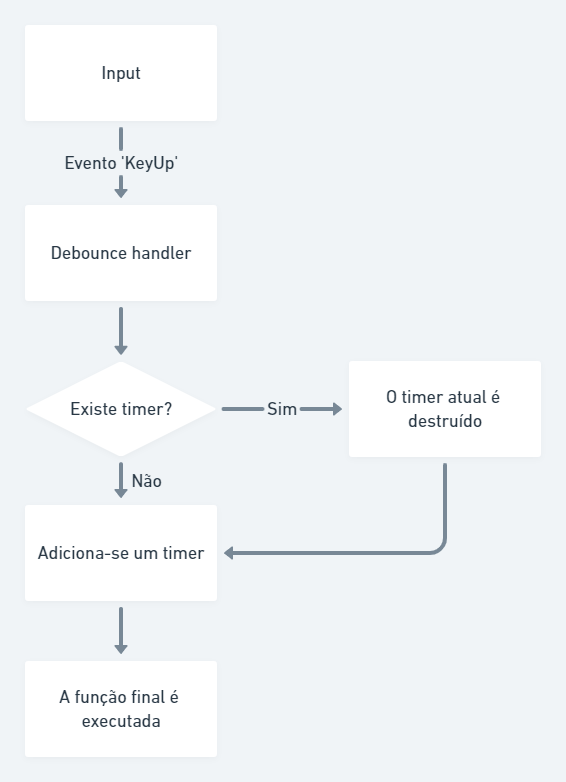

# Debounce

O debounce consiste, basicamente, em uma espera entre o disparo de um evento. Suponhamos que dado um `input` do HTML, precisemos usar o seu conteúdo para fazer uma consulta a uma API.

Fazer o acesso a API a cada alteração do campo é algo funcional, mas impacta em uma grande utilização de recursos, de maneira... desnecessária. Esta é uma situação em que a espera entre os eventos de digitação pode ajudar.

Esquema:

<div align="center">



</div>

Nos arquivos deste repositório será possível encontrar este exemplo:


# Como usar

Para usar usar o debounce em um evento da DOM, como o `keyup`, basta fazer o seguinte:

```javascript
const debounceEvent = (fn, wait = 1000, timeout) => (...args) => {
  clearTimeout(timeout, (timeout = setTimeout(() => fn(...args), wait)));
};

document.querySelector('input').addEventListener(
  'keyup',
  debounceEvent((event) => console.log(event.target.value), 1000),
);
```
